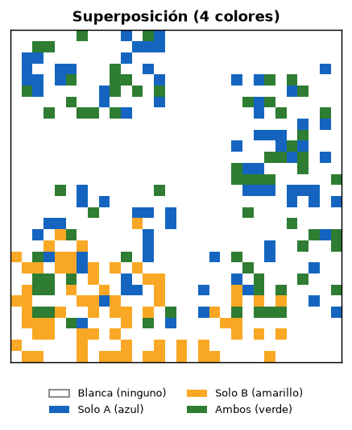
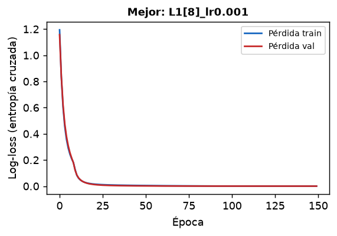
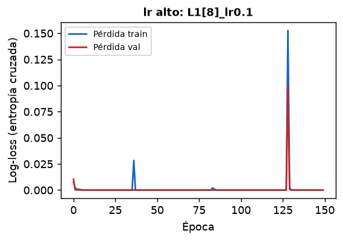
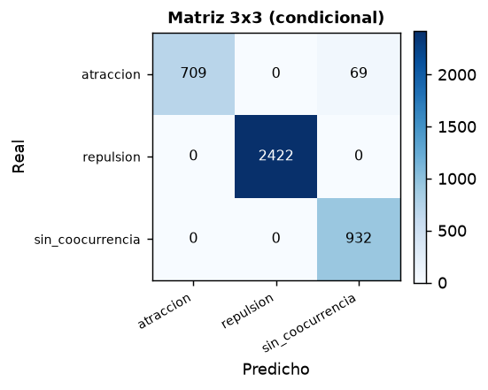
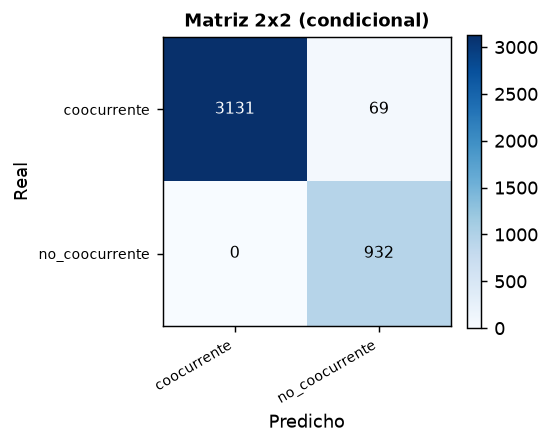
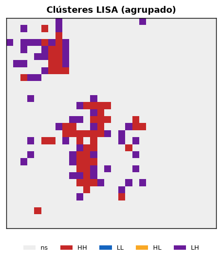
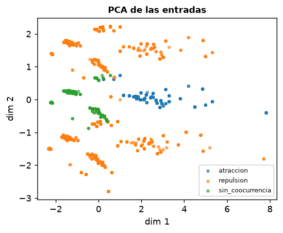
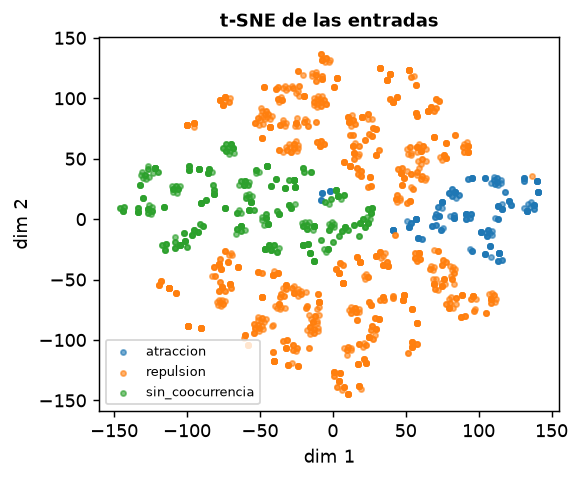

# Clasificación de coocurrencia espacial mediante K de Ripley y Perceptrón Multicapa

### Evaluación en espacio condicional, comparación de modelos y análisis de dependencia espacial

*Reimplementación en Python del proyecto original en R, con corrección
metodológica y rigor de taller de posgrado.*

> **Nota sobre el dominio.** Este trabajo no es el taller de *Verticillium*
> (severidad de una enfermedad en cultivos). Se toma ese taller únicamente
> como **vara de rigor metodológico**. El problema aquí es la **coocurrencia
> de dos patrones de puntos espaciales** (dos "colores" en una grilla), medida
> con la K de Ripley y clasificada con una red neuronal, tal como plantea el
> profesor en la reunión del 18/06/2026 y en las grabaciones de soporte.

---

## 1. Introducción

En epidemiología de patrones espaciales (flores, banano, palma; también cáncer
o cólera) es clave detectar la
**coocurrencia** entre dos eventos: si la aparición de un patrón se asocia
espacialmente con otro, controlar uno puede corregir el otro. La herramienta
estándar para cuantificar asociación en patrones de puntos es la **K de Ripley**
(univariada y su versión cruzada K₁₂), desarrollada a finales de los años 80.

El objetivo es: (i) simular dos patrones de puntos sobre una grilla, (ii)
calcular su K de Ripley univariada y cruzada, (iii) construir un conjunto de
datos **a nivel de celda** y (iv) entrenar y comparar clasificadores
(perceptrón multicapa y línea base logística) que reproduzcan las etiquetas de
coocurrencia (`atraccion`, `repulsion`, `sin_coocurrencia`), evaluando de forma
**honesta** su desempeño.

**Corrección metodológica central (lo que pide el profesor).** El script R
original calculaba la precisión sobre las 900 celdas de la grilla, incluidas
las **celdas blancas** (sin ningún evento). Como en la práctica el ~80 % de la
grilla queda vacía, la clase mayoritaria "vacío" **inflaba artificialmente** la
exactitud. La corrección consiste en **condicionar el espacio muestral a las
celdas coloreadas** (azul = solo A, amarillo = solo B, verde = ambos) y reportar
las celdas blancas **aparte**, como información descriptiva para el productor,
sin usarlas para medir el modelo (reunión, min. 30–37).

---

## 2. Exploración y preprocesamiento

### 2.1. Generación de patrones

- **Grilla** N×N parametrizable (default 30×30 = 900 celdas).
- **Patrón A**: `agrupado` (clústeres), `disperso` (inhibición por distancia
  mínima) o `aleatorio` (CSR). Número de puntos **1–500** (ya no limitado a 150).
- **Patrón B**: generado **condicionado** a A mediante el parámetro
  *celdas coincidentes* (0 … nº de celdas ocupadas por A). Esto fuerza una
  cantidad **controlada** de coocurrencia real, en lugar de generar A y B
  independientes (lo que hacía que casi todo cayera en `sin_coocurrencia`).
- **Reproducibilidad**: `numpy.random.default_rng(seed)` en todo el pipeline.

*Figura 1. Superposición de A (azul) y B (amarillo); en verde las celdas de
coocurrencia (ambos), en blanco las celdas sin evento.*

### 2.2. K de Ripley (validación de la implementación)

La K se implementó **directamente** con corrección de borde **isotrópica**
(equivalente a `spatstat::Kest(correction="iso")`):

$$\hat{K}(r) = \frac{|A|}{n(n-1)}\sum_{i\ne j}\mathbf{1}(d_{ij}\le r)\,e_{ij},
\qquad e_{ij}=1/w(i,d_{ij}),$$

donde `w(i,d)` es la proporción de la circunferencia de radio `d` centrada en el
punto `i` que cae dentro de la ventana (calculada analíticamente por
inclusión-exclusión de los arcos exteriores en cada borde). **Validación**: bajo
CSR, la K estimada reproduce `K(r)=πr²` con error < 1 % en todos los radios
probados (r = 0.05–0.25), lo que confirma la equivalencia con el estimador de
`spatstat`.

### 2.3. Dataset a nivel de celda (espacio condicional)

Para cada celda se generan: `ocupa_p1`, `ocupa_p2` (binarias), `k1_val`,
`k2_val`, `k12_val` (y normalizadas `*_n`), `cls1_f`, `cls2_f` (clases
univariadas) y las etiquetas `clase_celda` (3 clases) y `clase_binaria`.

Reglas de etiquetado (profesor, min. 35–37):

- **verde** (ambos) → clase bivariada real de K₁₂: `atraccion` / `repulsion` /
  `sin_coocurrencia`.
- **azul/amarillo** (un solo evento) → `repulsion` ("cuando aparece solo un
  color… esa sería la categoría repulsiva").
- **blanca** (ninguno) → se marca y se **excluye** del cómputo del modelo.

### 2.4. Balance de clases (dataset de 150 simulaciones, grilla 30×30)

De **135 000** celdas simuladas, **109 345 (81.0 %)** son blancas y se excluyen;
quedan **25 655** celdas coloreadas. Distribución de las 3 clases:

| clase | n celdas |
|---|---:|
| repulsion | 16 160 |
| sin_coocurrencia | 6 264 |
| atraccion | 3 231 |

Hay **desequilibrio notable**: la clase `repulsion` (dominada por celdas de un
solo color) es la mayoritaria. Se documenta y se mitiga con: (i) métricas por
clase, macro-promedio y matrices de confusión (no solo accuracy), (ii) partición
por simulación (evita fuga), (iii) `class_weight`/regularización en los modelos
base. El 81 % de blancas confirma cuantitativamente la preocupación del profesor:
incluirlas dominaría el accuracy.

---

## 3. Metodología

### 3.1. Particiones

La partición se hace **por simulación** (`sim_id`), no por celda: como las
variables de K son a nivel de patrón (constantes dentro de una simulación),
partir por celda produciría **fuga de información** entre train y test. Se
comparan:

| esquema | n_train (celdas) | n_test | accuracy_test |
|---|---:|---:|---:|
| 70/15/15 | 17 439 | 4 132 | 0.9833 |
| 80/20 | 20 158 | 5 497 | 0.9874 |

**Ventaja del esquema de tres particiones**: el conjunto de **validación**
permite seleccionar hiperparámetros (arquitectura, tasa de aprendizaje, época de
parada) sin tocar el test, de modo que la estimación final en test queda
**insesgada**. Con solo train/test se corre el riesgo de sobreajustar los
hiperparámetros al propio test. El 80/20 da un accuracy ligeramente mayor por
disponer de más datos de entrenamiento, pero **no ofrece un conjunto limpio para
seleccionar el modelo**.

### 3.2. Validación cruzada k-fold (agrupada)

Con `GroupKFold` (grupo = `sim_id`, k = 5) para robustez: accuracy media
**0.994 ± 0.007** (folds: 1.000, 0.986, 0.998, 1.000, 0.987). Dado el tamaño
moderado (150 simulaciones), la validación cruzada es un **complemento**
apropiado: reduce la varianza de la estimación frente a una única partición.

### 3.3. Comparación de arquitecturas

Se entrenaron **18 configuraciones**: capas ocultas ∈ {1, 2, 3} (dos
configuraciones de neuronas cada una) × tasa de aprendizaje ∈ {0.001, 0.01, 0.1}.
Extracto:

| config | capas | lr | acc_train | acc_val |
|---|---:|---:|---:|---:|
| L1[8]_lr0.001 (mejor) | 1 | 0.001 | 1.000 | 1.000 |
| L2[16x8]_lr0.01 | 2 | 0.01 | 1.000 | 1.000 |
| L2[16x8]_lr0.1 | 2 | 0.1 | 0.902 | 0.814 |
| L3[32x16x8]_lr0.1 | 3 | 0.1 | 0.650 | 0.589 |

**Hallazgos** (ver curvas de aprendizaje, Figuras 2–3):

- Con tasas de aprendizaje pequeñas (0.001–0.01) **todas** las arquitecturas
  convergen a ~100 %: el problema es **casi determinista** a nivel de celda
  (ver §5).
- Con **lr = 0.1** aparece **subajuste/inestabilidad**: las curvas de pérdida
  no descienden de forma estable y la exactitud cae (0.81, e incluso 0.59 con 3
  capas). Es el caso de libro de una tasa de aprendizaje demasiado alta.
- Se elige el modelo **más simple** que alcanza el óptimo (1 capa, 8 neuronas):
  navaja de Occam.

*Figuras 2–3. Curvas de pérdida train/val: convergencia limpia del mejor
modelo vs. inestabilidad con lr = 0.1.*

### 3.4. Función de pérdida: entropía cruzada vs. MSE

| pérdida | accuracy_test | loss_final |
|---|---:|---:|
| entropía cruzada | 1.000 | 0.000 |
| MSE (one-hot) | 0.983 | 0.009 |

La **entropía cruzada** es superior, como predice la teoría: para clasificación,
la log-verosimilitud multinomial penaliza mejor las probabilidades mal
calibradas y su gradiente no se satura como el del MSE sobre una capa softmax.

---

## 4. Resultados (modelo final, test condicional)

### 4.1. Tres clases

Modelo final (1 capa, 8 neuronas, lr 0.001, 300 épocas), evaluado **solo en
celdas coloreadas**:

- **Accuracy = 0.9833**, **Macro-F1 = 0.9726**, **Weighted-F1 = 0.9832**.
- **AUC-ROC (OvR)** = 1.00 para las tres clases.

| clase | precisión | recall | F1 | soporte |
|---|---:|---:|---:|---:|
| atraccion | 1.000 | 0.911 | 0.954 | 778 |
| repulsion | 1.000 | 1.000 | 1.000 | 2422 |
| sin_coocurrencia | 0.931 | 1.000 | 0.964 | 932 |

La clase más difícil es **`atraccion`** (recall 0.911): parte de sus celdas se
confunden con `sin_coocurrencia`, porque la frontera entre atracción e
independencia en K₁₂ es sensible al radio y al número de puntos. La `repulsion`
(celdas de un solo color) es perfectamente separable por los indicadores de
ocupación.

*Figura 4. Matrices de confusión 3×3 y 2×2 sobre el espacio condicional. Junto
a ellas, el pipeline reporta que se **excluyeron 16 568 celdas blancas** del
conjunto de test (informativas, no usadas para el accuracy).*

### 4.2. Problema binario (coocurrente / no_coocurrente)

Al colapsar a dos clases, el MLP alcanza **accuracy = sensibilidad =
especificidad = F1 = 1.000**. Este resultado es **trivialmente perfecto** y hay
que interpretarlo con cuidado: bajo el criterio de ocupación del profesor,
"coocurrente" = celda verde = `ocupa_p1 ∧ ocupa_p2`, que es una función
determinista de dos de las entradas. Es un resultado correcto pero **poco
informativo** (ver Discusión).

### 4.3. Comparación honesta con el enfoque original

El script R reportaba ~94 % **sobre las 900 celdas**. Dado que el 81 % son
blancas, ese número está dominado por la clase vacía y **no mide la capacidad
real** de distinguir tipos de coocurrencia. Al condicionar a celdas coloreadas
el accuracy sigue siendo alto (98.3 %), pero ahora es **honesto**: se calcula
sobre las celdas que efectivamente importan.

---

## 5. Discusión

**El problema es cuasi-determinista a nivel de celda.** Las variables de K
(`k1_n`, `k2_n`, `k12_n`, `cls1_f`, `cls2_f`) son **constantes dentro de una
simulación** (son estadísticos del patrón completo). Por tanto, lo único que
varía celda a celda son los indicadores de ocupación, y la etiqueta queda
determinada por (ocupación) + (clase K₁₂ del par). Esto explica tres
observaciones convergentes:

1. Casi todas las arquitecturas llegan a ~100 % (no hay ambigüedad que aprender).
2. El problema binario es perfectamente separable.
3. La **regresión logística binaria sufre separación perfecta**: los errores
   estándar y p-valores **no son identificables** (matriz de información
   singular). El pipeline lo detecta y reporta coeficientes de una logística
   regularizada (L2), marcando el hallazgo.

Este es, en sí mismo, el hallazgo metodológico más valioso: la alta exactitud
**no** proviene de que la red "descubra" la coocurrencia, sino de que la
etiqueta es casi una función de las entradas. La contribución real del trabajo
es (a) la **evaluación condicional honesta** y (b) señalar que, para que el
problema sea no trivial, hay que enriquecer las entradas (ver §7).

**Comparación de modelos.** MLP y SVM empatan (accuracy 0.9833, Macro-F1
0.9726); Random Forest queda muy cerca (0.9789). Para un sistema de apoyo a la
decisión se preferiría el **MLP simple** o incluso la **logística** por
interpretabilidad y costo computacional, dada la naturaleza casi determinista.

---

## 6. Análisis de dependencia espacial

Se evaluó la **coherencia espacial** (preocupación explícita del profesor:
cólera, epidemiología de patrones) con el **Índice de Moran** sobre la variable
ordinal de estado de celda (0 = blanca, 1 = un color, 2 = verde), usando pesos
de contigüidad *queen* y p-valores por permutación (499 permutaciones).

| patrón | Moran I | p-valor | interpretación |
|---|---:|---:|---|
| agrupado | **0.191** | 0.002 | autocorrelación **positiva**: los eventos se agrupan |
| aleatorio | −0.020 | 0.238 | sin dependencia espacial significativa |
| disperso | −0.079 | 0.002 | autocorrelación **negativa**: contraste con vecinos |

El **LISA** (Moran local) sobre el patrón agrupado identifica **55 celdas HH**
(alta rodeada de alta) y 55 LH, confirmando clústeres espaciales locales.

*Figura 5. Mapa de clústeres LISA para un par de patrones agrupados: los focos
HH marcan las regiones de coherencia espacial.*

**Lectura agronómica**: si los eventos de dos plagas/enfermedades muestran Moran
positivo y clústeres HH coincidentes, existe coherencia espacial explotable
(controlar una zona-foco puede mitigar ambas). El patrón aleatorio no ofrece esa
palanca.

---

## 7. Propuesta propia

Se implementaron varias extensiones no solicitadas explícitamente:

### 7.1. Comparación con Random Forest y SVM

Misma partición y métricas (§5). Sirve de control: confirma que el desempeño no
depende del clasificador, sino de la estructura del problema.

### 7.2. Robustez ante ruido en las K

Se añadió ruido gaussiano creciente a `k1_n`, `k2_n`, `k12_n` del test:

| nivel de ruido (σ rel.) | accuracy |
|---:|---:|
| 0.00 | 0.9833 |
| 0.10 | 0.9828 |
| 0.20 | 0.9806 |
| 0.30 | 0.9748 |
| 0.50 | 0.9724 |

La degradación es **suave**: el modelo es robusto porque se apoya sobre todo en
la ocupación (que no se perturba). Esto **cuantifica** la baja dependencia de
los valores de K, coherente con la importancia de variables.

### 7.3. Regularización (early stopping y L2)

El *gap* train−test es pequeño (~0.017) y estable frente a `alpha` y
*early stopping*, como se espera en un problema sin sobreajuste real. (Se usa L2
y early stopping como alternativa a *dropout*, no disponible en scikit-learn.)

### 7.4. Reducción de dimensión (PCA / t-SNE)

*Figura 6. Proyecciones 2D de las entradas coloreadas por clase: las clases
forman regiones bien separadas, ilustrando la separabilidad del problema.*

### 7.5. Importancia de variables (permutación vs. logística)

| variable | importancia MLP (perm.) | rank MLP | \|coef\| logit | rank logit |
|---|---:|---:|---:|---:|
| ocupa_p1 | 0.335 | 1 | 6.908 | 1 |
| ocupa_p2 | 0.308 | 2 | 6.345 | 2 |
| k12_n | 0.115 | 3 | 0.527 | 4 |
| cls1_f | 0.032 | 4 | 0.153 | 6 |
| k1_n | 0.001 | 6 | 0.336 | 5 |

Ambos métodos coinciden en el **top-2** (los indicadores de ocupación) y en que
**`k12_n`** es la variable de K más relevante (es la que fija la subclase de las
celdas verdes). El **Lasso** selecciona **solo** `ocupa_p1` y `ocupa_p2`,
confirmando la redundancia de las K a nivel de celda. La selección backward por
**AIC** conserva un subconjunto pequeño (`k1_n`, `k2_n`, `k12_n`, `cls1_f`,
`ocupa_p2`).

### 7.6. Etiquetado por envolventes vs. umbral (propuesta del propio profesor)

Se implementó la clasificación por **envolventes de simulación Monte Carlo**
(bandas bajo CSR / independencia) además del umbral fijo `πr²·(1±0.15)`. El
**acuerdo entre ambos métodos es solo del 32.5 %** sobre 40 pares: el umbral
fijo y la envolvente etiquetan de forma muy distinta. La envolvente es
**estadísticamente más defendible** (controla el error tipo I mediante
simulación y se adapta al nº de puntos), a costa de mayor costo computacional.
Esto responde directamente a la duda del profesor en el audio sobre "meter
categorías en lugar de valores de K" y usar envolventes.

### 7.7. Propuesta de mejora estructural

Dado que el problema es cuasi-determinista, se propone (línea de trabajo futuro,
ya facilitada por la arquitectura modular): **enriquecer las entradas** con
(i) valores de K en **varios radios** (no solo r = 0.2), en particular en los
radios de inflexión que definen la envolvente (idea del profesor); (ii)
**features locales por celda** (nº de vecinos ocupados de cada patrón en un
radio), que sí varían dentro de la simulación y harían el aprendizaje no
trivial; (iii) tratar la severidad/coocurrencia como variable **ordinal**.

---

## 8. Conclusiones

1. Se corrige el error señalado: las métricas se calculan **solo sobre celdas
   coloreadas**; las blancas (81 % de la grilla) se reportan aparte. El accuracy
   honesto es **98.3 %** (3 clases), frente al ~94 % inflado del enfoque original.
2. La generación **condicionada** de B (celdas coincidentes) resuelve el
   desbalance extremo hacia `sin_coocurrencia` que motivó la reunión.
3. La K de Ripley (iso) se implementó desde cero y se **validó** contra `πr²`
   (error < 1 %), sin depender de `spatstat`.
4. El análisis sistemático (particiones, k-fold, 18 arquitecturas, CE vs MSE,
   logística, importancia, Moran/LISA, RF/SVM, ruido, PCA/t-SNE) muestra que el
   problema es **cuasi-determinista a nivel de celda**, lo que se manifiesta en
   la separación perfecta de la logística y en el ~100 % del caso binario.
5. El **valor metodológico** no está en maximizar el accuracy (engañoso), sino
   en la evaluación honesta y en identificar cómo hacer el problema no trivial
   (features por radio y locales). Esto coincide con el recordatorio del taller:
   *un modelo simple bien interpretado vale más que uno complejo sin análisis*.

---

## 9. Reproducibilidad y código

- Código modular en `coocurrencia/` (funciones con docstrings).
- Pipeline: `python report/run_pipeline.py` (semilla `SEED = 42`).
- App interactiva: `streamlit run app/streamlit_app.py`.
- Figuras en `report/figuras/`, tablas en `report/tablas/`
  (`resultados.json`, `resultados_tablas.md`).
- Dependencias en `requirements.txt`.
